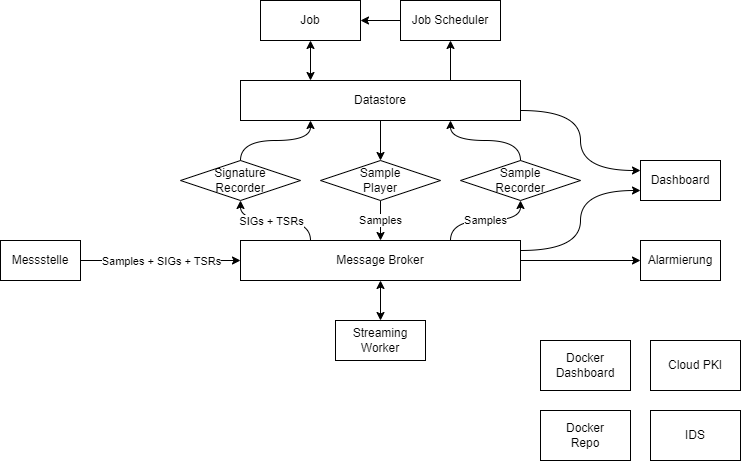
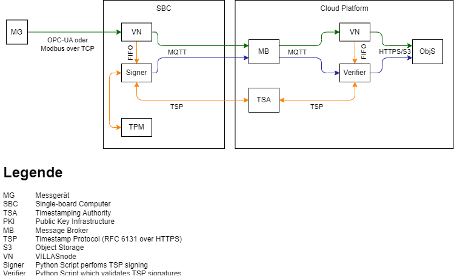
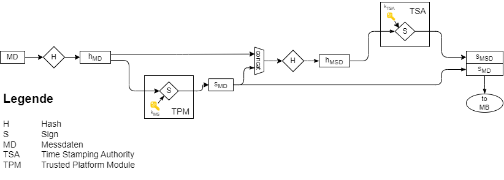

# Platform

This is the Git repository of the SEGuRo platform.

## Architecture

### Platform Architecture



### Data Integrity



### Signing Chain



## Configuration

See [.env](./.env).

## Usage

1. Install SEGuRo project (and its dependencies) in editable mode
```bash
pip install poetry
poetry install
```
2. Start platform via Docker Compose
```bash
docker compose up --detach --build
```

3. Open [landing page](https://localhost)

### Default credentials

The administrator credentials can be configued in the `.env` file.

The defaults are:

- **Username:** admin
- **Password:** s3gur0herne

## Development

### With [Docker](https://www.docker.com/) & [Devcontainer](https://containers.dev/)

1. Install Docker, Git & Visual Studio Code
2. Clone Repo: `git clone git@github.com:SEGuRo-Projekt/Plattform.git`
3. Open Repo as [Devcontainer in Visual Studio Code](https://code.visualstudio.com/docs/devcontainers/containers)
  - Press:  Ctrl + Shift + P
  - Type: `Dev Containers: Reopen in container`
  - Press Enter
  - Wait (the initial setup can take a couple of minutes)

### Manual

1. Clone Repo: `git clone git@github.com:SEGuRo-Projekt/Plattform.git`
2. Install Poetry: `pip install poetry`
3. Install Python packages and dependencies: `poetry install`
4. Start Platform via Docker Compose: `docker compose up -d`

## Accessing Platform

The components compromising the SEGuRo platform are accessible via various sub-domains of `seguro`:

- [`localhost`](https://seguro) Platform Landing Page
- [`ui.localhost`](https://ui.seguro) Docker Web-Interface ([Yacht](https://yacht.sh/))
- [`store.localhost`](https://store.seguro) S3 Datastore ([Minio](https://min.io/))
- [`ui.store.localhost`](https://ui.store.seguro) S3 Datastore Web-Interface
- [`registry.localhost`](https://registry.seguro) Docker Image Registry ([distribution](https://distribution.github.io/distribution/about/))
- [`ui.registry.localhost`](https://ui.registry.seguro) Docker Image Registry Web-Interface ([docker-registry-ui](https://github.com/Joxit/docker-registry-ui))

### Accessing remotely

In case the platform is not deployed on the same host from which you attempt accessing it, further steps are necessary:

#### For development: Patching `/etc/hosts`

Please add the following line to your `/etc/hosts` file and substitute the IP address with the one on which the Docker Compose stack is running:

```text
172.23.157.5 seguro ui.seguro store.seguro ui.store.seguro registry.seguro ui.registry.seguro
```

You then can access the links above by substituting `localhost` with `seguro`.

#### Production

For production setup, you will need to register and configure a domain name (environment variable `DOMAIN` in `.env`) and point its `A` and `AAAA` records to the IP address of your Docker host.

## License

- SPDX-FileCopyrightText: 2023 Steffen Vogel, OPAL-RT Germany GmbH\
- SPDX-FileCopyrightText: 2023 Felix Wege, EONERC-ACS, RWTH Aachen  University\
- SPDX-License-Identifier: Apache-2.0
