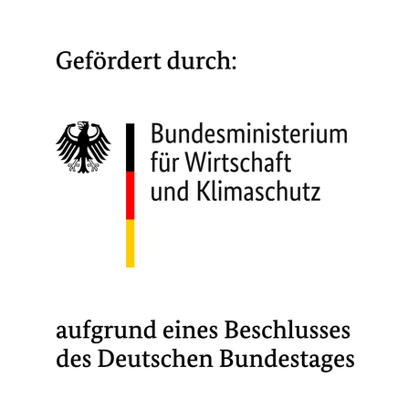

# SEGuRo Platform

This is the Git repository containing the SEGuRo platform.

## Documentation

Please visit the public documentation here:

- **https://seguro-projekt.github.io/Platform/**

## Code

- [GitHub](https://github.com/SEGuRo-Projekt/Platform)

## Partners

- [RWTH Aachen University, Institute for Automation of Complex Power
    Systems](https://acs.eonerc.rwth-aachen.de)
- [Hochschule Bochum](https://www.hochschule-bochum.de/)
- [OPAL-RT Germany](https://opal-rt.com)
- [Stadtwerke Herne](https://www.stadtwerke-herne.de/)
- [Utimaco GmbH](https://utimaco.com/)
- [Rhebo GmbH](https://rhebo.com/)

## Acknowlegements

We are grateful for the financial support of the [BMWK (Federal Ministry of Economics and Climate Protection)](https://www.bmwk.de/), funding reference [03El6085](https://www.enargus.de/pub/bscw.cgi/?op=enargus.eps2&q=%2201249617/1%22).

## License

- SPDX-FileCopyrightText: 2023-2024 Steffen Vogel, OPAL-RT Germany GmbH
- SPDX-FileCopyrightText: 2023-2024 Felix Wege, EONERC-ACS, RWTH Aachen  University
- SPDX-License-Identifier: Apache-2.0
