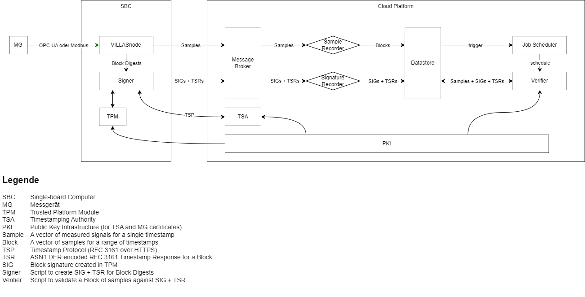

# Platform

This is the Git repository of the SEGuRo platform.

## Architecture

### Platform Architecture


### Data Integrity



### Signing Chain


## Configuration

See [.env](./.env).

## Usage

1. Install SEGuRo project (and its dependencies) in editable mode
```bash
pip install -e .
```
2. Start platform via Docker Compose
```bash
docker compose up --detach --build
```

3. Open [landing page](https://localhost)

### Default credentials

#### Yacht

- **Username:** admin@yacht.local
- **Password:** pass

#### Minio

- **Username:** seguro
- **Password:** stwh4herne


## Development

1. Install Docker, Git & Visual Studio Code
2. Clone Repo: `git clone git@github.com:SEGuRo-Projekt/Plattform.git`
3. Open Repo as [Devcontainer in Visual Studio Code](https://code.visualstudio.com/docs/devcontainers/containers)
  - Press:  Ctrl + Shift + P
  - Type: `Dev Containers: Reopen in container`
  - Press Enter
  - Wait (the initial setup can take a couple of minutes)

## License

- SPDX-FileCopyrightText: 2023 Steffen Vogel, OPAL-RT Germany GmbH\
- SPDX-FileCopyrightText: 2023 Felix Wege, EONERC-ACS, RWTH Aachen  University\
- SPDX-License-Identifier: Apache-2.0
