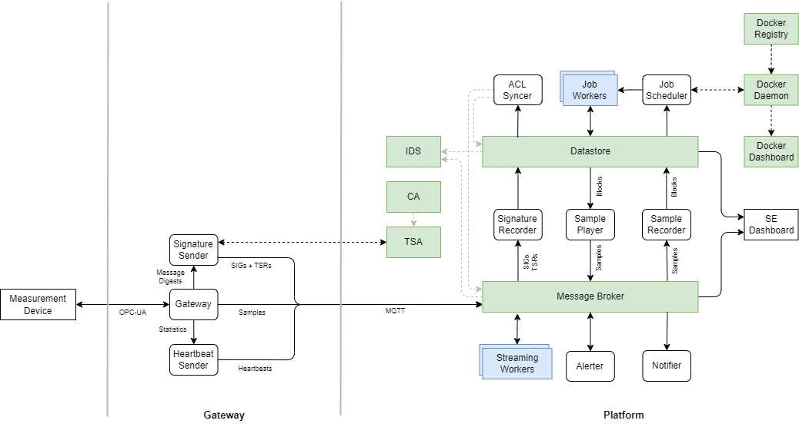
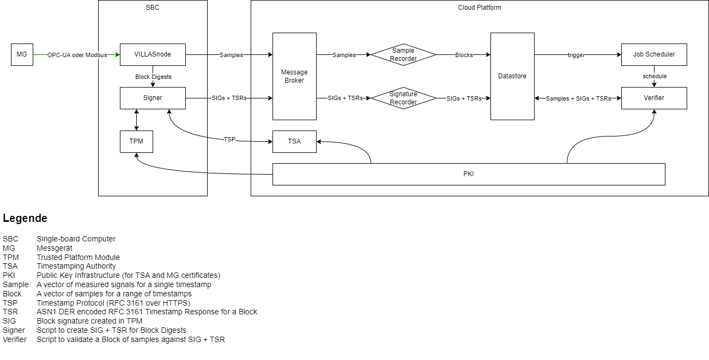
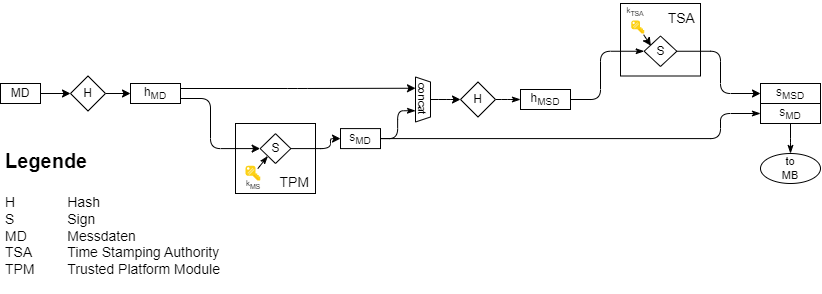

# Architecture

The following figure shows the architecture of the platform & measurement gateway consisting of the individual components, their interactions and data flows:



This platform comprises the digital twin in the form of a DPsim simulation as well as a persistent datastore for offline data and messages (models, time series, analysis scripts, archived measurement series, etc.) and a flexible message broker for real-time data.

## Components

The architecture of SEGuRo platform is divided into two parts:

```{toctree}
:maxdepth: 1

platform
gateway
```

The platform itself is deployed in a datacenter and handles data storage, processing and simulation.
The gateway is deployed in the field and establishes connectivity of field devices such as measurement devices with the platform via the means of a mobile network or wired WAN connectivity.

Most communication between the platform and the gateway is performed via TLS-encrypted MQTT.

## Authentication

The SEGuRo platform strictly encrypts and authenticates all communication between the platform and gateway as well as all internal communication using Mutual Transport Layer Security (mTLS).

Mutual TLS authentication, also known as client certificate authentication or two-way TLS authentication, is a secure communication protocol through which both client and server authenticate each other before sharing data. This is achieved using digital certificates, a fundamental concept in a system called [Public Key Infrastructure (PKI)](platoform.md#Public Key Infrastructure (PKI)).

A digital certificate, simply put, is a verified digital ID card for a device or a server. It confirms the identity, helping ensure that communication only occurs between verified, trusted entities. This certificate is created, issued, and verified by a Certificate Authority (CA), which acts like a trusted third party. The certificate contains the entity's public key, and the CA guarantees the association between the identity of the entity and this public key.

In standard TLS (Transport Layer Security) authentication, only the server is authenticated by the client; the client trusts the server if its certificate is verified. But in Mutual TLS (mTLS), both the server and the client are authenticated by each other.

The essential steps are:

1. Server and client start communication. The client requests the server's certificate.
2. The server sends its certificate to the client.
3. The client verifies the server's certificate with the CA.
4. If the server's certificate is verified, the client sends its own certificate.
5. The server requests verification of the client's certificate with the CA.
6. If verification succeeds, the server allows a secure connection to the client.

This bidirectional authentication makes mTLS more secure than standard TLS. It prevents unauthorized clients from accessing the server, as a valid certificate is required. For an electrical engineer, this might be akin to having two-factor authentication in a hardware system. Just as you'd want to ensure a device or system is interfacing with trusted hardware before sending/receiving data, TLS ensures data is being exchanged between trusted entities in the digital space.

One important note for software implementation: working with mTLS requires proper management of digital certificates, such as regular renewal and revocation checks, to maintain a high level of security.

In conclusion, mTLS authentication is a robust method for secure data communication between a client and a server, well-suited for applications where both entities require assurance of each other's identity.

## Data Integrity

```{note}
**ToDo:** This section still needs to be written.
```



### Signing Chain

```{note}
**ToDo:** This section still needs to be written.
```


